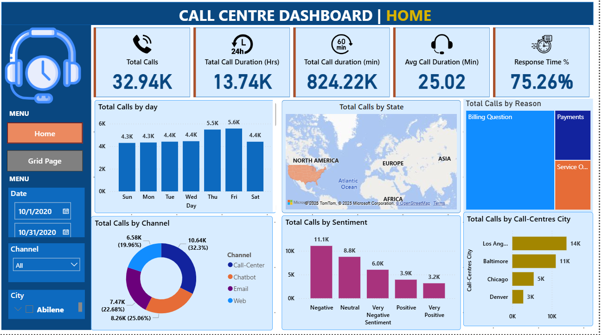

# Call-Centre-Dashboard

# Call Centre Dashboard Power BI Model

This project provides a Power BI model for analyzing call center performance using key metrics derived from raw call data. The solution includes a robust data table, calculated columns, and essential KPIs to help visualize call center activities and performance.


## Features

- **Dynamic Date Table**: Automatically generated to cover the full range of call timestamps.
- **Day Field Column**: Extracts day names to enable day-wise analysis.
- **KPIs**:
  - **Total Calls**: Counts the total number of calls using unique IDs.
  - **Total Call Duration (Minutes & Hours)**: Summarizes total duration of calls in both minutes and hours.
  - **Average Call Duration**: Calculates the average duration of calls (formula to be added).
  - **Response Time**: Placeholder for future development.
- **Visualization**:
  - **Column Chart**: Visualizes total calls per day with 'day' on the X-axis and 'total calls' on the Y-axis.

## How to Use

1. **Import Data**: Load your call center data into Power BI, ensuring columns such as `Id`, `Call Timestamp`, and `Call Duration In Minutes` are present.
2. **Create Date Table**:
   ```powerbi
   Date Table = CALENDAR(MIN('Call Center_Call Center'[Call Timestamp]), MAX('Call Center_Call Center'[Call Timestamp]))
   ```
3. **Add Day Field Column**:
   ```powerbi
   day = FORMAT('Date Table'[Date], "ddd")
   ```
4. **Define KPIs**:
   - **Total Calls**:
     ```powerbi
     Total Calls = COUNT('Call Center_Call Center'[Id])
     ```
   - **Total Call Duration (Minutes)**:
     ```powerbi
     Total Call duration (min) = SUM('Call Center_Call Center'[Call Duration In Minutes])
     ```
   - **Total Call Duration (Hours)**:
     ```powerbi
     Tatal Call Duration (Hrs) = [Total Call duration (min)] / 60
     ```
   - **Average Call Duration (Minutes)**:
     ```powerbi
     Average Call Duration (min) = [Total Call duration (min)] / [Total Calls]
     ```
   - **Response Time**: (To be implemented based on available data.)

5. **Build Visuals**:
   - Create a column chart with `day` on the X-axis and `Total Calls` on the Y-axis.

## Contribution

Feel free to fork the repository and suggest improvements or new KPIs relevant to call center analytics.

## License

This project is open source and available under the MIT License.


